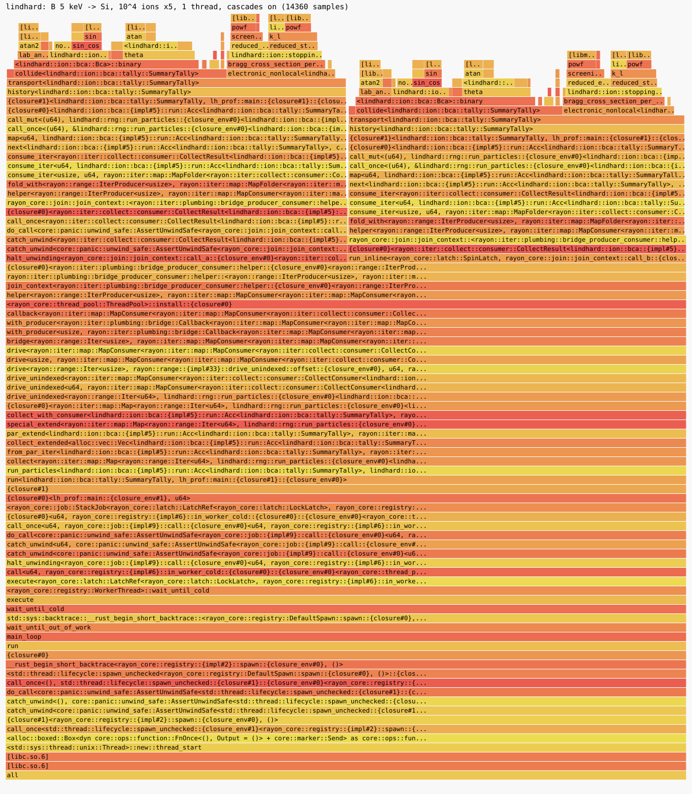

# Benchmarks

Performance is a tracked number. The benches are [criterion](https://crates.io/crates/criterion)
micro-benchmarks and an ions/s throughput benchmark. They are **local only**:
they never run under `cargo test`. CI only checks that they compile
(`cargo clippy --workspace --all-targets` builds every bench target).

## Running

```sh
cargo bench -p lindhard                      # everything (several minutes)
cargo bench -p lindhard --bench scattering   # one file
cargo bench -p lindhard --bench history -- 'history_'   # filter by name
cargo bench -p lindhard --bench history -- --quick      # fast, rough
cargo bench --no-run                         # compile only
```

Close other work first: on a loaded machine the numbers are inflated and
noisy, and the thread-scaling benchmark is the most sensitive to this.
All inputs are deterministic (fixed seeds, fixed ion counts, one shared
scattering table), so run-to-run differences are timing noise only.

## What is measured

| Bench file | Group | Measures |
|---|---|---|
| `scattering.rs` | `theta_1024_points` | Table lookup vs magic formula vs Gauss-Mehler quadrature for 1024 (eps, beta) points |
| `stopping.rs` | `stopping_256_energies` | `ElectronicStopping::stopping` over a 256-point log energy sweep for Lindhard-Scharff, Oen-Robinson, the equipartition mix and Bethe-Bloch, plus the Oen-Robinson local loss |
| `history.rs` | `history_100_ions_single_thread` | One history at a time (`Bca::history`) for B 5 keV, As 50 keV into Si and Ar 1 keV into Cu, 7 degrees off normal |
| `history.rs` | `cascade_and_free_path_B_5keV_Si_1000_ions` | Full cascade vs ions only (`follow_recoils`), constant vs energy-dependent free path |
| `history.rs` | `tally_overhead_B_5keV_Si_1000_ions` | The light `SummaryTally` vs the full `IonTally` (histograms, moments, damage, escapes) on the same histories |
| `history.rs` | `throughput_<problem>_10k_ions` | 10^4 ions through `Bca::run` on explicit rayon pools of 1, 2, 4, ... up to the machine's parallelism |

Free-path selection is measured through the engine (constant vs
energy-dependent convention), since the selection code is private to
`Bca`. Targets use illustrative `E_d` = 15 eV, cutoffs 5 eV (primary) and 2 eV
(recoil), and the ZBL universal potential with Lindhard-Scharff stopping; these
are benchmark settings, not recommendations.

## Reading the results

* Criterion prints `time:` as `[low estimate high]` (a confidence interval)
  and, where a throughput is declared, `thrpt:` in elements per second. For
  `history.rs` and `stopping.rs` an element is one ion or one evaluation, so
  **`thrpt` is ions/s** (or evaluations/s).
* Compare **ratios within one run** (cascade vs ions only, 1 thread vs N
  threads); absolute numbers belong to one machine.
* Thread scaling: ideal is `ions/s(N) = N * ions/s(1)`. Because the engine is
  deterministic across thread counts (the stream is keyed on the primary
  index, chunk size is fixed), the work is identical at every N; a shortfall
  is scheduling, memory or a loaded machine, not different physics.
* Cost per ion varies by orders of magnitude between problems (cascade size
  grows with the primary energy and the mass ratio), so ions/s is only
  comparable between codes on **matched problems and settings** (cascades on
  or off, cutoffs, mean-free-path convention).

## Sample numbers

Taken at commit `9aed2ab` (clean-room tree plus this bench set), 2026-10-05,
Apple M3 Ultra (28 logical CPUs), macOS, rustc 1.98.1, `cargo bench -- --quick`.
**The machine was heavily loaded (load average above 24) during these runs**, so
treat them as order-of-magnitude and rerun on a quiet machine before quoting.
They are not assertions and nothing checks them.

| Benchmark | Result |
|---|---|
| theta, table lookup | about 35 ns per point |
| theta, magic formula | about 1.05 us per point |
| theta, quadrature | about 2.75 us per point |
| Lindhard-Scharff stopping | about 73 ns per evaluation |
| Oen-Robinson / equipartition mix | about 66 ns per evaluation |
| Bethe-Bloch (proton in Si) | about 16 us per evaluation |
| One history, B 5 keV Si (cascade) | about 4.1 k ions/s, 1 thread |
| One history, As 50 keV Si (cascade) | about 0.41 k ions/s, 1 thread |
| One history, Ar 1 keV Cu (cascade) | about 23 k ions/s, 1 thread |
| B 5 keV Si, ions only | about 20 k ions/s (about 5x the cascade) |
| B 5 keV Si, `IonTally` vs `SummaryTally` | about 5% slower |
| B 5 keV Si, 10^4 ions, 1 thread | about 4.5 k ions/s |
| B 5 keV Si, 10^4 ions, 28 threads | about 50 k ions/s (loaded machine) |

Observations: the lookup table is about 30 times cheaper than the magic
formula, so it is not a hot spot; with cascades on, the cost is dominated by
the number of collisions, which the ions-only row shows is mostly recoil
cascade work. Bethe-Bloch is about 200 times the cost of Lindhard-Scharff per
evaluation, which is irrelevant for keV implants but would matter if it were
called per collision at MeV energies.

## Oracle comparison (ions/s)

Source: the committed summaries in
[`../validation/oracles/summaries/`](../validation/oracles/summaries/README.md)
(format `lindhard-oracle-summary/2`, written by `validation/oracles/run.py`,
PR #59). This section only tabulates our own numbers and the ratios from
those files. No oracle output, input or source is committed
([`../CONTRIBUTING.md`](../CONTRIBUTING.md) Oracles). The oracle matrix was
**not** re-run for this section.

**Where and when.** 2026-10-05, Apple M3 Ultra (`Darwin arm64`, 28 logical
CPUs), lindhard built with rustc 1.98.1 at `7c76596` (the `_weak3` problem
at `782e3cc`). Oracles, run unmodified: RustBCA `v3.0.0-17-ga356280`
(`cargo build --release`, rustc 1.98.1) and OpenTRIM `1.2.0`
(`v1.1.6-84-g6b12392`, CMake Release, GCC 16.2.0). Every code used all 28
logical CPUs. This is a different machine from the profile below.

**The comparison is load-affected.** The host's load average at the start of
each run is in its summary: **30.7** for every problem except
`ar_1keV_cu_ed_es_weak3` (**66.1**), from unrelated jobs. All three programs
were timed under the same load, one after another, so the ratios are
indicative; absolute rates are not quotable. A quiet-machine re-measure
(`run.py --timing-factor` sets N2/N1) is still outstanding (#76).

**OpenTRIM runs with electronic loss off.** Its electronic stopping choices
are SRIM tables or DPASS, both excluded from this project, so every
`opentrim-*.json` summary records `"electronic_stopping": "Off"` and lists it
as the first mismatch (see also [`validation.md`](validation.md)). lindhard
and RustBCA run Lindhard-Scharff. **None of the OpenTRIM speed ratios is
like-for-like, the primary-only ones included**; see "Reading it" below.

**Two rates.** *End-to-end* is process wall clock at 20 000 ions, setup
included: lindhard builds its scattering table (about 0.2 s) and RustBCA
writes its particle lists, so at this ion count setup dominates lindhard.
*Marginal* is `(N2 - N1) / (t2 - t1)` between 20 000 and 100 000 ions, with
fixed costs removed. The marginal rate is the throughput of the transport.
Ratios are lindhard / oracle (above 1: lindhard faster).

| Problem | Oracle | lindhard end-to-end (k ions/s) | oracle end-to-end | lindhard marginal | oracle marginal | **marginal ratio** | end-to-end ratio | Load |
|---|---|---|---|---|---|---|---|---|
| `b_5keV_si` | RustBCA | 81.9 | 103.8 | 413.6 | 72.8 | **5.68x** | 0.79x | 30.7 |
| `b_5keV_si` | OpenTRIM | 81.9 | 54.2 | 413.6 | 97.6 | **4.24x** | 1.51x | 30.7 |
| `as_50keV_si` | RustBCA | 83.9 | 110.4 | 380.0 | 112.5 | **3.38x** | 0.76x | 30.7 |
| `as_50keV_si` | OpenTRIM | 83.9 | 80.9 | 380.0 | 109.5 | **3.47x** | 1.04x | 30.7 |
| `ar_1keV_cu` | RustBCA | 93.2 | 5.2 | 791.8 | 5.8 | 135.86x | 17.81x | 30.7 |
| `ar_1keV_cu` | OpenTRIM | 93.2 | 144.7 | 791.8 | 373.6 | 2.12x | **0.64x** | 30.7 |
| `ar_1keV_cu_ed_es` | RustBCA | 72.9 | 5.1 | 205.9 | 6.1 | 33.96x | 14.40x | 30.7 |
| `ar_1keV_cu_ed_es` | OpenTRIM | 72.9 | 81.1 | 205.9 | 194.6 | 1.06x | 0.90x | 30.7 |
| `ar_1keV_cu_ed_es_weak3` | RustBCA | 66.3 | 2.0 | 178.1 | 2.2 | 81.69x | 32.50x | 66.1 |
| `ar_1keV_cu_ed_es_weak3` | OpenTRIM | 66.3 | 69.5 | 178.1 | 286.1 | **0.62x** | 0.95x | 66.1 |

lindhard's own transport-only rate (no process start or table build) is in
each summary as `ions_per_s_transport_only`: 332.5 k/s (B), 359.6 k/s (As),
630.1 k/s (Ar, Cu `E_d` 30 eV), 223.0 k/s and 170.6 k/s (Ar, Cu `E_d` 3.49 eV
without and with three weak collisions).

**Reading it, as measured.**

* **Every OpenTRIM ratio includes the electronic-loss difference, which
  acts in both directions.** OpenTRIM skips the stopping evaluation, which
  in the profile below is about 28 % of lindhard's time (B 5 keV into Si,
  one thread, a different machine; the share differs per problem). Without
  electronic loss, its ions and recoils also keep more energy, travel
  further and collide more often before they stop, which costs OpenTRIM
  time. The net effect on each ratio is not known from these runs. A
  like-for-like run needs an electronic-loss-off choice in lindhard's CLI
  (#58).
* On the two **primary-only range problems** (`b_5keV_si`, `as_50keV_si`),
  the marginal throughput of lindhard is 5.7x and 3.4x RustBCA's (the
  matched comparison, both on Lindhard-Scharff) and 4.2x and 3.5x
  OpenTRIM's (not matched, see above). End-to-end at 20 000 ions lindhard is
  **slower than RustBCA** (0.76 to 0.79x) because of its fixed table build,
  and about level with OpenTRIM (1.04x) or ahead of it (1.51x), with the
  same OpenTRIM caveat.
* On the **cascade problems** (`ar_1keV_cu*`) the ratios are **not a
  like-for-like speed comparison** and must not be quoted as one. The codes
  do different amounts of work. RustBCA's rate is 5 k ions/s and the ratios
  reach 34 to 136x, most likely because RustBCA follows far more recoils
  (its `Ed` does not act as a displacement threshold; the summaries show
  only that its sputter yield does not depend on `Ed`). OpenTRIM follows
  recoils with one shared energy cutoff, no surface barrier and no
  electronic loss (and, for `_weak3`, no weak collisions). The OpenTRIM
  cascade ratios, which carry all of these differences, are mixed: lindhard is **slower** end-to-end on
  `ar_1keV_cu` (0.64x) and on the marginal rate for the three-weak-collision
  problem (**0.62x**), about level on `ar_1keV_cu_ed_es` (1.06x), and
  ahead on `ar_1keV_cu` marginal (2.12x).
* The matching of physics is not perfect and the throughput depends on it;
  each summary lists `matched` and `mismatches` (random streams, impact
  parameter limit, first free flight, scattering-angle integration).

**Matched settings per problem** (the full lists are in the summary files).
All: ZBL universal potential; electronic loss Lindhard-Scharff, all
non-local, in lindhard and RustBCA (`LOW_ENERGY_NONLOCAL`) and **off in
OpenTRIM**; constant mean free path `n^(-1/3)` (RustBCA `LIQUID`), planar
surface barrier where the oracle has one (OpenTRIM has none), densities Si
2.329 g/cm^3 and Cu 8.96 g/cm^3, normal incidence (RustBCA needs 1e-5 rad
off the axis), 20 000 ions at the end-to-end point and 100 000 at the
second marginal point.

| Problem | Beam | Target `E_d` (eV), density (g/cm^3) | Cutoffs: primary / recoil (eV) | Recoils followed | Weak collisions | Electronic loss: lindhard / RustBCA / OpenTRIM |
|---|---|---|---|---|---|---|
| `b_5keV_si` | B 5 keV | Si 15, 2.329 | 5 / 2 | no (primary only) | 0 | LS / LS / off |
| `as_50keV_si` | As 50 keV | Si 15, 2.329 | 5 / 2 | no (primary only) | 0 | LS / LS / off |
| `ar_1keV_cu` | Ar 1 keV | Cu 30, 8.96 | 2 / 1 | yes | 0 | LS / LS / off |
| `ar_1keV_cu_ed_es` | Ar 1 keV | Cu 3.49 (= `E_s`), 8.96 | 2 / 1 | yes | 0 | LS / LS / off |
| `ar_1keV_cu_ed_es_weak3` | Ar 1 keV | Cu 3.49 (= `E_s`), 8.96 | 2 / 1 | yes | 3 per step | LS / LS / off |

LS = Lindhard-Scharff, non-local.

## Profile

Single-threaded run of 10^4 ions, B 5 keV into Si, 7 degrees off normal,
seed 1: the `throughput_B_5keV_Si_10k_ions` problem of `history.rs` (cascades
on, constant free path, ZBL + Lindhard-Scharff, `E_d` = 15 eV, cutoffs
5 eV / 2 eV). Run on one pool thread so the profile is attributable, with the
same fixed seed and ion count every time (the physics is identical from run
to run; sample counts vary a little with timing).



[`img/flamegraph-b-si.svg`](img/flamegraph-b-si.svg) (49 kB; hover a frame
for its sample count; root at the bottom; frames below 0.4 % are not drawn).

**Method and conditions.** 2026-10-06, `lindhard` at `add8f40` (clean tree
plus this change), rustc 1.97.1, Linux 7.0.0-1013-aws, Intel Xeon Platinum
8488C, 8 vCPUs shared with other jobs (**load average 7 to 9** during the
run), release profile (`lto = "fat"`, `codegen-units = 1`) with
`-C force-frame-pointers=yes` and line tables. The run is the 10^4 ions
repeated five times in one process (50 000 ions in 14.6 s, 3.4 k ions/s on
this loaded host, 14 360 samples at 1 kHz of CPU time), after the table
build. `perf_event_paranoid = 4` prevented unprivileged `perf`, so the
samples come from a small `SIGPROF` sampler that walks the frame-pointer
chain ([`tools/profile/sigprof_sampler.rs`](../tools/profile/sigprof_sampler.rs)),
symbolized with `addr2line` including inlined frames
([`tools/profile/symbolize_samples.py`](../tools/profile/symbolize_samples.py)) and drawn by
[`tools/profile/perf_to_svg.py`](../tools/profile/perf_to_svg.py). The last script also reads
`perf script -F ip,sym` output, so on a machine where `perf record
--call-graph fp` works the same graph can be made from that. Frames inside
libm and libc carry only the library name (they have no exported symbol for
the internal routines), so libm time is attributed to its caller below.

**To reproduce.** Build `sigprof_sampler.rs` as its own throwaway crate
(`lindhard` by path, `libc` and `rayon` as dependencies; point its `#[path]` at
`lindhard/benches/common/mod.rs`) with `RUSTFLAGS="-C
force-frame-pointers=yes"`, a release profile with `debug =
"line-tables-only"` and `strip = "none"`, then run it (x86_64 Linux only; it
writes `samples.txt` and `maps.txt` to the current directory). Then
`python3 tools/profile/symbolize_samples.py <binary> > perf.txt` and
`python3 tools/profile/perf_to_svg.py flamegraph-b-si.svg "title" < perf.txt`.

**Result.** Shares are of all samples; "inclusive" includes callees.

| Rank | Hot spot | Inclusive | What it is |
|---|---|---|---|
| 1 | `scattering angle chain in Bca::binary` (`ScatteringTable::theta`, `kinematics::lab_angles`, `sin` of the half angle) | about 34 % (`theta` 21 %, `lab_angles` 9 %, `sin` 3.2 %) | `theta`'s own bilinear interpolation is 6.6 %; the rest is `exp` and `atan` (about 9 %) and `atan2` (7 %) from libm |
| 2 | `ElectronicStopping::stopping` for Lindhard-Scharff, reached through `electronic_nonlocal` | 28 % (of 32 % for `electronic_nonlocal`) | about 20 % of all samples is `powf` in `screening_length` and `k_l`, which depend only on `Z1, Z2, M1, M2` and are recomputed every flight |
| 3 | `kinematics::rotate` (new direction after a collision) | 20 % | `sin_cos` 10 % and `normalize` 5.5 % |

Together these are about 80 % of the run; libm transcendental calls alone
(`pow`, `sin`/`cos`, `atan2`, `atan`, `exp`) are about 57 % of all samples.
RNG (ChaCha8, 1 %), the energy-ordered stack of particles, tallies and
geometry are each at or below a few percent.

**SoA / SIMD verdict: not warranted now.** The time is not spent moving or
laying out data, it is spent in scalar transcendental functions, a large
part of which is avoidable arithmetic: the `powf` constants depend on
nothing that changes during a history, and the angle chain converts
between angle and sine/cosine forms several times per collision. Those are
algorithmic changes within the present layout (cache the Lindhard-Scharff
constants per ion and target pair; carry `cos` and `sin` of the angles instead
of recomputing them from the angle; reduce the number of `normalize` calls).
Only after those would a layout change be worth measuring, which is
consistent with `architecture.md` ("do not do SoA/SIMD first"). Those
optimizations were made in #37 (next section).

## Hot-path work (#37)

Phase 1 of the performance epic (#36): the three hot spots above, within
the present layout. Nothing about the physics changed; every model keeps its
citation.

| Hot spot | Change |
|---|---|
| 1. Scattering-angle chain | The table already stores `ln tan(theta/2)`. `ScatteringTable::half_angle_tan` returns `tan(theta/2)` (one `exp`) and the collision derives everything else by algebra: `sin(theta/2) = t / sqrt(1 + t^2)`, `cos(theta/2) = 1 / sqrt(1 + t^2)`, the energy transfer `gamma E sin^2(theta/2)`, the projectile deflection `(sin psi, cos psi) = (sin theta, cos theta + mu) / norm` (`kinematics::lab_projectile_sc`) and the recoil deflection `phi = (pi - theta)/2`, whose sine and cosine are `cos(theta/2)` and `sin(theta/2)`. This removes `atan`, `atan2`, `sin(theta/2)`, `sin theta`, `cos theta` and the polar `sin_cos` of both rotations per collision. |
| 2. Lindhard-Scharff stopping | `ElectronicStopping::sqrt_energy_coefficient` (defaulted to `None`) lets a model that is exactly `S = c sqrt(E)` say so. `Bca::new` sums `x_j c_j` over each layer's elements once per projectile species, so a flight costs one `sqrt`. The six `powf` per flight are gone. Models without that form (and any model that could fail) use the general Bragg path as before, so errors are still reported at evaluation. |
| 3. `rotate` | `kinematics::rotate_sc` takes `(sin, cos)` pairs; the azimuth `sin_cos` is shared by the weak-collision surface test and the collision, and the recoil's `azimuth + pi` is the negated pair. The final `normalize` (square root and division) is replaced by the first-order renormalization `v (3 - \|v\|^2) / 2`, exact to 1e-32 for a unit vector perturbed by rounding; a test keeps 2x10^5 chained rotations unit to 1e-14. |

`Bca::run` and the new `Bca::history_in` also reuse the particle stack and the
per-flight scratch (`HistoryBuffers`) instead of allocating them per history,
so the collision loop makes no heap allocation in steady state:
[`lindhard/tests/alloc.rs`](../lindhard/tests/alloc.rs) installs a counting
global allocator and checks zero allocations over 150 cascade histories
(more than 10^4 collisions) in each of the constant free path, the
energy-dependent free path with the equipartition electronic loss, and three
weak collisions. A buffer grows only while it sees a cascade larger than any
before it.

**Bit-identity.** Results are not bit-identical to the previous commit,
because the floating-point operations differ (about 1e-16 relative per
quantity); a particle history is chaotic, so single histories diverge, but the
distributions do not: the level-1 validation harness (`cargo test -p lindhard
--test validation`) and the BCA integration tests pass unchanged. They remain
bit-identical across thread counts (`bit_identical_across_thread_counts` in
`lindhard/tests/bca.rs`, 1, 2 and 8 threads, with and without weak
collisions).

**Measured.** 2026-10-07, Intel Xeon Platinum 8488C, 8 vCPUs shared with
other jobs (**load average 7 to 12 throughout**), rustc 1.99.0, release profile
(`lto = "fat"`, `codegen-units = 1`), one rayon thread, criterion bench
`history.rs` `throughput_<problem>_10k_ions/threads_1` (10^4 ions, seed 1,
cascades on, 7 degrees off normal), `--sample-size 10`. The before binary
(`301e436`) and the after binary were run alternately, three rounds each, so
that load drift affects both; the table gives the median of the three
estimates. Absolute numbers on this loaded host are not quotable; the ratio is
the result (the rounds of one binary differed by up to 20 %).

| Problem | Before (ions/s) | After (ions/s) | Ratio |
|---|---|---|---|
| B 5 keV into Si | 3.4 k | 8.3 k | 2.5x |
| As 50 keV into Si | 0.37 k | 0.82 k | 2.2x |
| Ar 1 keV into Cu | 16.9 k | 46.3 k | 2.7x |

**Profile after** (same method and sampler as above, 5 x 10^4 ions of B 5 keV
into Si on one thread, 6 565 samples; 7.3 k ions/s in the sampler build, against
3.4 k ions/s in the profile above, taken on the same kind of loaded host). Flame
graph: [`img/flamegraph-b-si-after.svg`](img/flamegraph-b-si-after.svg).

| Before | After (share of all samples) |
|---|---|
| Stopping, 28 % (`powf` 20 %) | `electronic_nonlocal` 3.1 % |
| Angle chain, about 34 % | `half_angle_tan` 23 % (of which `exp` and the two `ln` of the lookup are most) plus `lab_projectile_sc` 6.6 % |
| `rotate`, 20 % (`sin_cos` 10 %, `normalize` 5.5 %) | `rotate_sc` 8.3 % (`normalize` 1.6 %); the remaining `sin_cos`, 14.6 %, is the azimuth, one per collision |

libm calls are now about 31 % of the samples as self time (57 % before). What
remains is the table lookup (two `ln` and one `exp` per collision) and the
azimuth `sin_cos`. Those are the next candidates, ahead of any layout change;
the SoA / SIMD verdict stays "not yet".

## Not yet covered

* **A quiet-machine re-measure of the oracle comparison, and a thread-scaling
  curve (#76).** The numbers above were taken under load (30 to 66); re-run
  `validation/oracles/run.py` on an idle machine, one problem at a time, to
  replace them, and report ions/s at 1, 2, 4, ... N threads (the only
  scaling data here is 1 vs 28 threads on a loaded machine).
* **A like-for-like OpenTRIM comparison (#58)**, which needs an
  electronic-loss-off choice in lindhard's CLI.
* **Profile of the all-thread run, and of the As and Ar problems.** The
  single-thread B profile is the one #9 asks for; different cascade sizes
  shift the weights (the stopping evaluation is per flight, the angle chain
  per collision).
