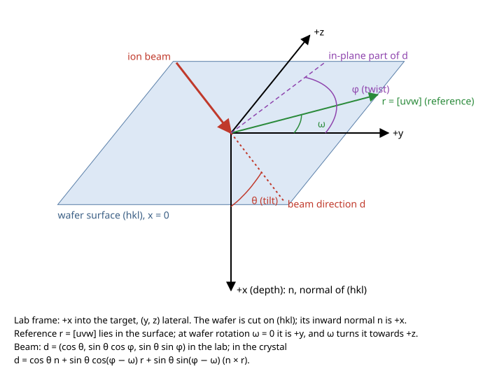

# Crystal targets: lattice, wafer orientation and beam divergence

This page states the conventions of `lindhard::ion::crystal` (step 19a of the
M2 crystal plan): how a cubic lattice is described, how the beam direction in
the lab becomes a direction in the crystal, and how beam divergence is
sampled. It is a data model only; the transport engine does not read it yet.
The code docs (`lattice`, `orientation` and `divergence` modules) carry the
same statements next to the code.



## Lattice

`Lattice` holds the face-centred cubic primitive (Bravais) vectors, a basis of
sites with their atomic numbers, and the cubic lattice constant together with
the temperature that constant refers to.

| Structure | Space group | Basis (lattice coordinates of the primitive vectors) | Source |
|---|---|---|---|
| Diamond (A4): Si, Ge | Fd-3m (227) | `(1/8, 1/8, 1/8)`, `(7/8, 7/8, 7/8)` | Mehl et al. (2017), p. 616 |
| Zincblende (B3): GaAs, 3C-SiC | F-43m (216) | first species `(0, 0, 0)` (Zn, 4a); second `(1/4, 1/4, 1/4)` (S, 4c) | Mehl et al. (2017), p. 543 |

Primitive vectors: `a1 = (0, a/2, a/2)`, `a2 = (a/2, 0, a/2)`,
`a3 = (a/2, a/2, 0)`, so the primitive cell holds 2 atoms in `a³/4` and the
atom number density is `8/a³`. Reference: M. J. Mehl et al., "The AFLOW
Library of Crystallographic Prototypes: Part 1", Comput. Mater. Sci. 136, S1
(2017), doi:10.1016/j.commatsci.2017.01.017 (arXiv:1607.02532v1).

The presets and their lattice constants (every value has a row in
[`data-provenance.md`](data-provenance.md)):

| Preset | `a` | Temperature | Source |
|---|---|---|---|
| `Lattice::silicon()` | 5.431 020 511(89) Å | 22.5 °C, in vacuum | CODATA 2022, Table XXXIV |
| `Lattice::germanium()` | 5.6576 Å | 25 °C | NBS Circular 539, Vol. I (1953), pp. 18-19 |
| `Lattice::gallium_arsenide()` | 5.652 Å | 25 °C | NBS Monograph 25, Section 3 (1964), p. 33 |
| `Lattice::silicon_carbide_3c()` | 4.3596 Å | 297 K | Ioffe NSM archive, citing Taylor and Jones (1960); primary not opened |

The lattice is rigid: no thermal expansion is applied, and the temperature
is metadata of the cited value. Thermal vibration is the separate Debye
model in `ion::crystal::debye`; the target temperature it uses is an input of
the crystal flight model (`CrystalTarget::thermal`, see `ion::bca::crystal`),
not this temperature.

Miller indices `(hkl)` and directions `[uvw]` refer to the conventional cubic
cell. The plane normal is the reciprocal lattice vector
`g = h b1 + k b2 + l b3` with `b_i = 2π (c_j × c_k) / V` (Mehl et al.,
eq. (10)); a direction is `u c1 + v c2 + w c3`. Since `c_i · b_j = 2π δ_ij`
(eq. (9)), `[uvw]` lies in `(hkl)` exactly when `hu + kv + lw = 0` (the zone
law).

## Frames and angles

* **Crystal frame**: Cartesian axes along the cube edges; `[100]` is
  `(1, 0, 0)`.
* **Lab frame**: the frame of the geometry module. `+x` is depth, into the
  target; `y` and `z` are lateral.
* **Wafer cut** `(hkl)`: its normal `n` is the crystal direction of lab `+x`,
  so `(hkl)` names the **inward** normal and a beam at zero tilt travels along
  `n`. Pass `(-h, -k, -l)` to name the outward normal instead; this matters
  only for polar faces.
* **Reference direction** `[uvw]`: a lattice direction in the surface
  (`hu + kv + lw = 0`, checked). Its unit vector `r` is the crystal direction
  of lab `+y` at zero wafer rotation. The third axis is `t = n × r`, lab `+z`.
* **Tilt** `θ`: polar angle of the beam from `+x`, in `[0°, 90°)`.
* **Twist** `φ`: azimuth of the beam about `+x`, in the surface, from `+y`
  towards `+z`. The lab beam is `(cos θ, sin θ cos φ, sin θ sin φ)`, the same
  formula as `ion::bca::Beam::direction` with `polar_rad = θ`,
  `azimuth_rad = φ`.
* **Wafer rotation** `ω`: the wafer turns about `+x` by `ω`, right-handed, so
  `r` moves from `+y` towards `+z`.

The crystal-to-lab rotation is `M = R_x(ω) B`, with `B` the matrix of rows
`n`, `r`, `t`; the lab-to-crystal rotation is `Mᵀ`. The beam in the crystal
frame is

```text
d = cos θ n + sin θ cos(φ − ω) r + sin θ sin(φ − ω) t.
```

**The reference direction is explicit.** Tools differ on what twist is
measured from. Here it is always the `[uvw]` the caller passes; there is no
hidden default. For example, Nordlund, Djurabekova and Hobler, Phys. Rev. B
94, 214109 (2016), doi:10.1103/PhysRevB.94.214109, Sec. II B, describe the
incidence direction on a `[001]` surface by tilt `θ` and twist `ϕ`, with
`[011]` at `θ = 45°, ϕ = 0°` and `[111]` at `θ = 54.73°, ϕ = 45°`, so their
twist zero is an in-plane `<100>` axis. With `n = [001]`, `r = [010]` this
module gives `[011]` and `[-111]` (a `<111>` axis; the paper does not fix the
sense of `ϕ`). A wafer flat or notch direction can be passed as `r` instead.

### Worked example: tilt 7°, twist 22° on (100) Si

With `n = [100]`, `r = [010]`, `t = [001]` and `ω = 0`:
`d = (cos 7°, sin 7° cos 22°, sin 7° sin 22°)
= (0.992546, 0.112995, 0.045653)`. With the reference along a `<110>`,
`r = [011]/√2`, `t = [0, −1, 1]/√2`:
`d = (cos 7°, sin 7° (cos 22° − sin 22°)/√2, sin 7° (cos 22° + sin 22°)/√2)
= (0.992546, 0.047618, 0.112181)`. Both are tested to 1e-12
(`lindhard/tests/crystal.rs`).

## Beam divergence

`Divergence` deflects the central beam direction by a polar angle `ϑ` and an
azimuth `ψ`; `ψ` is uniform on `[0, 2π)`.

| Model | Meaning | CDF of `ϑ` | Draw |
|---|---|---|---|
| `Gaussian { sigma_rad: σ }` | independent normal deviations of s.d. `σ` in two orthogonal planes | `1 − exp(−ϑ²/2σ²)` (Rayleigh) | `ϑ = σ √(−2 ln(1 − U))` |
| `UniformCone { half_angle_rad: α }` | uniform in solid angle for `ϑ ≤ α` | `(1 − cos ϑ)/(1 − cos α)` | `ϑ = 2 asin(√U sin(α/2))` |

The Rayleigh law follows from writing the bivariate normal density in polar
coordinates; the cone law from the solid-angle element `sin ϑ dϑ dψ`. The
Gaussian treats the deviations as plane angles (the small-angle reading).

Draws come from the particle's own random stream, `rng::stream(seed,
index)`: exactly two per particle (`U`, then `V` for `ψ = 2πV`), none for
`Divergence::None`. The sampled directions are therefore bit-identical at
any thread count (tested). A one-sample Kolmogorov-Smirnov test at the 1 %
level checks both models against their CDFs (statistic as in the
NIST/SEMATECH e-Handbook, section 1.3.5.16; p-value from Kolmogorov's
limiting distribution, Marsaglia, Tsang and Wang, J. Stat. Softw. 8(18)
(2003), section 3).

## Not here yet

Hexagonal lattices (wurtzite, 4H/6H-SiC) and any input-file schema for
crystals are later steps. The collision search through lattice sites, and its
use of thermal displacements, are in `ion::bca::crystal`. D. S. Gemmell, Rev. Mod. Phys. 46, 129 (1974), is
the issue's background reference for channeling; it was not opened for this
step and nothing here rests on it.
